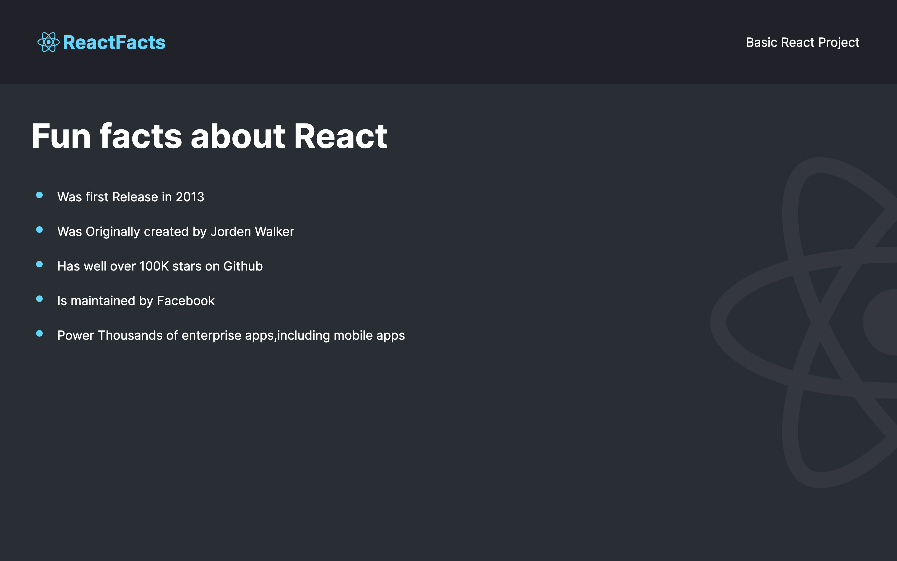

<h1 align="center">⚛ React Facts 👨‍💻</h1>

React Facts is a simple web application that provides you with some interesting facts about ReactJs. This web application is built using ReactJs, JavaScript, HTML, CSS, and Markdown. This web application is hosted on Netlify.

Click [here](https://reactfacts-rajeev.netlify.app/) to know some interesting facts about ReactJs.

## Tech stack

#### Frontend

- ReactJs
- JavaScript
- HTML
- CSS
- Markdown
- DOM

#### Other Tools

- VS Code
- Prettier
- Netlify
- Git

## Points to remember while testing the WebApp

1. First of all fork this [Repository](https://github.com/beRajeevKumar/React-Facts.git) and clone it.
2. Drag the project into VS Code.
3. Open the terminal and hit `npm install` command to install the dependencies.
4. After installing the dependencies, run the project using `npm run dev` command to start the development server.
5. Now, The App is now on `http://localhost:5000/` , So you can test the WebApp.

## Useful Links

- [Project Demo](https://reactfacts-rajeev.netlify.app/) - Live Project URL

- [Project Repository](https://github.com/beRajeevKumar/React-Facts.git)

## Need help?

Feel free to contact me on [Twitter](https://twitter.com/be_rajeevkumar) or [LinkedIn](https://www.linkedin.com/in/berajeevkumar/), know more about me at [iamrajeev.me](https://iamrajeev.me)

<h1 align=center>Happy Coding 👨‍💻</h1>
